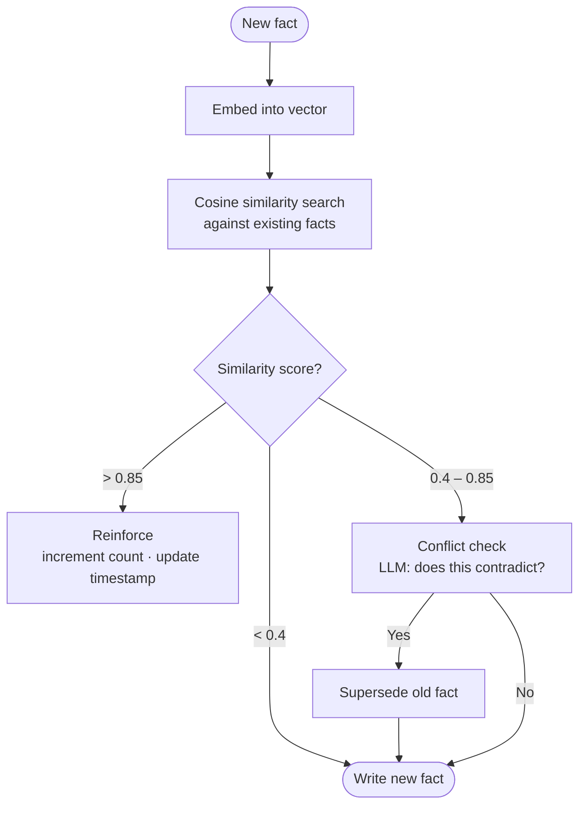
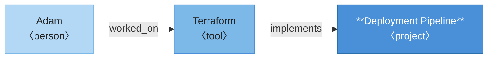

Every time you open a new chat with an AI assistant, it has forgotten everything about you. Your name, your preferences, what you were working on last week, the decision you made yesterday — gone. You start from scratch every single time.

This bothered me enough that I built my own. Krill is a local-first AI assistant, and its memory system is the part I've spent the most time thinking about. Here's how it works.

## The Shape of the Problem

The [CoALA framework](https://arxiv.org/abs/2309.02427) applies cognitive science's memory taxonomy to language agents: semantic memory (facts and concepts), episodic memory (past experiences), and procedural memory (how to do things). That framing maps cleanly onto what I wanted to build: an assistant that knows facts about you, remembers what happened between you, and understands how things relate.

In concrete terms, I wanted five things:

- **Persistence**: facts survive session restarts
- **Relevance**: surface the right information, not everything at once
- **Freshness**: older or contradicted facts should matter less over time
- **Relationships**: "you use Neovim" and "you edit code daily" are connected, not isolated
- **Local-first**: no cloud sync, no third-party data store, user owns their data

These requirements pull against each other in annoying ways. Keeping everything conflicts with expiring things. Being comprehensive conflicts with being selective. The interesting design work is in reconciling them.

## Extracting Facts from Conversation

After every conversation turn, I fire off an asynchronous LLM call to extract structured facts from what was just said. It runs in the background; the user never waits for it.

The extraction prompt asks for facts in a specific format. Each fact comes back with a content string ("user prefers Python over JavaScript"), a category (one of `identity`, `preferences`, `personal`, `work`, `other`), a confidence level (`explicit`, `implied`, or `inferred`), and boolean flags for `decision_point` and `emotional_signal` that I use later for episode synthesis.

The confidence levels matter. An explicit statement like "I prefer Python" gets 0.9. Something implied by context gets 0.7. A weak inference gets 0.5. Facts below 0.5 are dropped immediately.

### Deduplication

Before writing a new fact, I embed it with a 384-dimensional sentence embedding model and compare it against existing facts via cosine similarity. Three zones, three outcomes:

| Similarity | Action |
|---|---|
| > 0.85 | **Reinforce** — increment count, update timestamp, add session to source list |
| 0.4 – 0.85 | **Conflict check** — ask the LLM: does this contradict? |
| < 0.4 | **Write** — clearly new information |



The conflict check is where things get interesting. A hard threshold can't handle nuanced contradictions. "Uses Mac" and "switched to Linux for work" aren't duplicates, but they're in tension. I pass both facts to the LLM and ask: does the new fact contradict the old one, and if so which should survive? The answer depends on context only the LLM can evaluate.

## Not All Facts Are Equal

A fact mentioned once in passing shouldn't carry the same weight as one repeated a dozen times over six months. [MemoryBank](https://arxiv.org/abs/2305.10250) applies Ebbinghaus's forgetting curve to LLM memory, where memories decay over time and get reinforced on re-encounter. I took the same idea and made it explicit with a trust score:

```
trust = confidence × recency × boost
```

- **confidence**: the extraction-time score (0.5, 0.7, or 0.9)
- **recency**: decays with a 90-day half-life — `0.5^(days_since_reinforcement / 90)`
- **boost**: log-scale reward for repeated confirmation — `min(1.0 + 0.1 × log₂(1 + reinforcement_count), 1.5)`


A brand-new medium-confidence fact starts at 0.7. That same fact, reinforced five times over two months, climbs toward 1.0. A fact not mentioned for a year drops toward irrelevance. Trust scores also gate conflict resolution: if an existing fact has a trust score more than 1.5× higher than the incoming one, the old fact survives. You don't replace a well-established belief with a low-confidence passing mention.

## Getting the Right Facts into Context

Writing facts is the easy part. The hard part is retrieval: given what the user is saying right now, which facts should the assistant know about?

I inject memory in two layers. First, category summaries: for each category (identity, preferences, work, etc.), I maintain an LLM-synthesized narrative that gets rewritten whenever five or more new facts arrive. These go in first and give broad strokes. Then the top five facts retrieved by semantic similarity to the current user message, re-ranked by trust score, for specific detail.

Semantic search alone has a well-known failure mode: it finds facts that are topically nearby but misses exact keyword matches. If the user mentions a specific name or acronym, a dense embedding may not surface the right fact. I combine vector search with full-text search and merge the two ranked lists using reciprocal rank fusion (RRF). Neither list needs to be perfect — RRF is robust to noise in either source, and facts that rank highly in both float to the top.

When the memory store grows large, a lightweight LLM selector runs first to filter candidates, ranking by trust and picking only the ones actually relevant to the current query rather than blindly taking the top-N by embedding distance.

## Two Harder Problems

Facts answer "what do I know about you." But two questions remain: "what happened between us?" and "what is related to X?" Those need different structures.

### Episodic Memory: What Happened

Imagine you spent a session debugging a tricky race condition and ultimately decided to rewrite a module. The facts extracted might be: "user is debugging a concurrency bug," "user works on Krill," "user prefers explicit concurrency over async abstractions." Accurate, but they've lost the event. The diagnosis, the pivot, the three hours of back-and-forth that led to the decision.

Semantic search on those facts won't recover it. If you ask about that module next week, the search finds facts close to your query. It won't surface "we debugged a race condition and decided to rewrite" because that sentence doesn't exist in the store. It lived between the facts.

The [Generative Agents paper](https://arxiv.org/abs/2304.03442) showed how to handle this: record experiences as a memory stream, then synthesize them into higher-level summaries. I apply the same idea to a personal assistant. When a session produces enough signal (at least three facts, or a `decision_point` flag), I fire an LLM pass over the session's conversation history and produce a short narrative. Something like: "Debugged a race condition in the gateway's async loop. After ruling out the scheduler and lock ordering, found the issue was a missing await on a shared resource. Decided to rewrite the module with explicit locking rather than patching the existing code."

That narrative gets stored separately from facts and injected as "Relevant Experiences." Unlike facts, episodes are surfaced by recency as well as semantic similarity, because the most recent session is almost always relevant even if the topic has shifted.

The `decision_point` flag does real work here on two levels. At extraction time it's a boolean on individual facts, marking that something was a consequential choice. This lets a session trigger episode synthesis even if it produced only one or two facts — a session where you made one important architectural decision is worth narrating even if not much else was said. In the synthesized episode, `decision_point` becomes a string: the single most important choice or pivot from the session. This gives the assistant a specific handle on what was decided, not just that something happened.

### Knowledge Graph: What's Related

The second problem is structural. Semantic search retrieves facts that are textually similar to the current query. It fails when relevance is relational rather than lexical.

Suppose you ask about your deployment pipeline. Semantic search finds deployment-related facts. It won't find Adam. But suppose the memory contains "Worked on Terraform with Adam." The graph has encoded Adam as a person with a `worked_on` relation to Terraform, and Terraform with an `implements` relation to the deployment pipeline. Expand one hop from "deployment pipeline" and Terraform surfaces. Expand one more and Adam surfaces. Neither connection is a text match to your query; it's pure graph structure.



Every five new facts, I trigger a graph extraction pass. The LLM reads the accumulated facts and produces entities typed as `person`, `tool`, `concept`, `place`, `organization`, or `project`, plus directed typed relations: `uses`, `works_at`, `collaborates_with`, `created`, `skilled_in`, and so on. The relations aren't just labels — each edge carries the confidence of the source fact, the timestamp it was extracted, and which session it came from. That means when I traverse the graph to answer a query, I can weight edges by how reliable and recent they are, not just whether they exist.

One thing that surprised me: entities need deduplication just like facts. "Neovim", "nvim", and "that editor I use" all refer to the same thing. I run the same cosine similarity check against existing entities (threshold 0.85) and collapse them to a single node. Without this, the graph fragments across surface forms and loses its connective value.

Relations also drift. The LLM invents its own types when the seed taxonomy doesn't quite fit: `employs`, `works_with`, `relies_on` alongside the canonical `uses`. I run a periodic normalization pass that merges near-synonym types back to seeds via another LLM call, keeping the graph navigable.

## Prior Art

I'm not working in a vacuum. [MemGPT](https://arxiv.org/abs/2310.08560), now productized as [Letta](https://www.letta.com), pioneered one approach: agents explicitly manage their own memory via tool calls, deciding what to store and retrieve. It's an interesting design, but it puts memory management in the conversation layer. I went the opposite direction: memory extraction is a background harness service, invisible to the agent, so the conversation stays focused on the task.

[Mem0](https://mem0.ai) is the closest open-source analogue to what I built: fact extraction, deduplication, and retrieval as a standalone memory layer, well-adopted and actively developed. The main differences are that I add trust scoring with reinforcement (near-duplicate facts strengthen existing atoms rather than being silently dropped), episodic synthesis, and a knowledge graph, and keep everything local.

[Zep's Graphiti](https://github.com/getzep/graphiti) takes a different angle on the knowledge graph: facts have temporal validity windows (valid from time T, superseded at time T+N) rather than a continuous decay score. Different formalization of the same intuition. Worth reading their [paper](https://arxiv.org/abs/2501.13956).

## Why SurrealDB

I needed document storage, vector similarity search, full-text search, and graph edges in a single database that runs embedded with no server process. That last requirement eliminates most options.

Typically this means three or four systems: a document store, Qdrant for vectors, Elasticsearch for full-text, Neo4j for the graph. Coordinating them locally is painful. SurrealDB handles all of them. It runs in embedded mode (`surrealkv://`) with the entire memory system as a single file on disk.

Semantic search runs against a `MTREE` vector index with cosine similarity on 384-dim embeddings. Full-text search runs against a `SEARCH` index on the same table, and the two result sets are merged via RRF before re-ranking by trust.

Knowledge graph edges are `TYPE RELATION` tables, where each `RELATE` statement creates a first-class edge record that can carry arbitrary metadata — confidence, timestamp, source session — not just a label. Traversal is also bidirectional: `->references->` follows edges forward, `<-references` follows them in reverse. That means I can ask "what does Terraform implement?" and "what uses Terraform?" from the same edge table without duplicating data.

Facts, episodes, entity nodes, and category summaries all land in the same `atom` table but carry completely different metadata shapes — a fact has `confidence` and `category`, an entity has `entity_type` and `aliases`, an episode has `narrative` and `decision_point`. SurrealDB's schemaless documents mean each atom carries exactly the fields it needs, without padding every row with null columns or splitting atom types across separate tables.

SurrealDB is younger and less battle-tested than Postgres, and SurrealQL has a learning curve. But for local-first where deployment simplicity matters more than horizontal scaling, it's been the right call.

## What I Learned

Add trust scoring early. I bolted it on later and it touched everything: ranking, conflict gating, expiry. The formula takes microseconds; there's no good reason to wait.

Use an LLM for conflict resolution. My first instinct was a rule: if similarity is above some threshold and the new fact contradicts the old one, overwrite. But "contradicts" isn't binary. "Switched to Linux for work" and "uses Mac" are both true in different contexts. A rule gets this wrong; the LLM generally doesn't.

Episodic memory and facts serve different cognitive roles and you can't derive one from the other. Facts are what the assistant knows about you; episodes are what happened between you. I assumed episodes would fall out of the fact store naturally. They don't. They need their own extraction pipeline, their own storage, their own retrieval logic. Conflating them is a design mistake.

Category summaries saved me when the fact store got large. Semantic retrieval alone misses context that isn't textually close to the query. Summaries give a fallback that's always relevant regardless of what was asked.

Keep the database layer dumb. Every time I put logic there I regretted it. The intelligence is in the pipeline.
